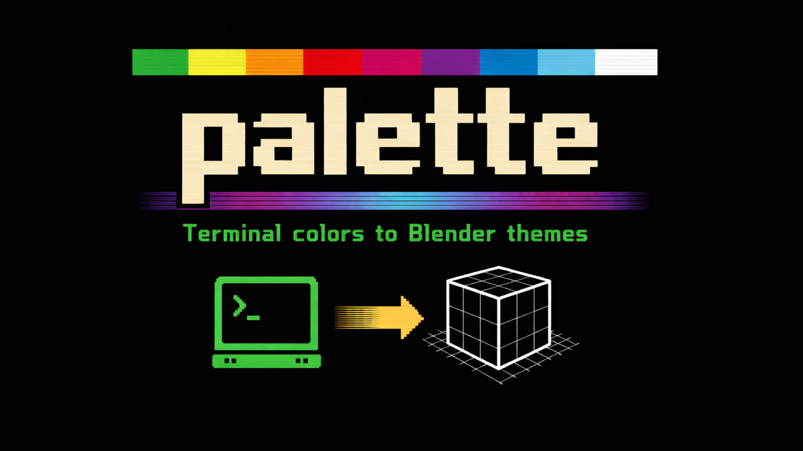

# Palette

<!-- 
 -->
<!--    -->
<!-- 
 -->

**Access over 600 terminal color schemes as Blender themes.**

Palette is a Blender add-on that converts terminal color schemes into full Blender UI themes. It sources palettes from public repositories at the press of a button, maps them to Blender's entire theme system, and lets you preview, edit, and apply them instantly.

---

## Getting Started

### Install

1. Download the `palette_v3.zip` file.
2. In Blender, go to **Edit → Preferences → Add-ons**.
3. Click **Install** and select the zip file.
4. Enable the **Palette** add-on by checking the box next to it.

The add-on panel will appear inside your Add-on preferences.

### Load Themes

When you first open the add-on, the theme list will be empty. You need to load themes from the online repositories before you can browse them.

1. Open the **Theme Browser** section (it's open by default).
2. Click the **Load Themes** button.
3. Wait for the download to complete. This fetches theme files from the iTerm2-Color-Schemes and Gogh repositories.

Once loaded, the full list of themes will appear and you can start browsing.

### Pick and Apply a Theme

1. Click any theme in the list to preview it. If **Live Preview** is enabled (it is by default), the Blender UI will update immediately.
2. Use the search bar to filter themes by name.
3. When you've found one you like, click **Apply** to set it as your theme.
4. If you change your mind, click **Reset** to go back to whatever theme you had before.

### Save Your Theme

**This is important.** Applying a theme changes your current Blender session, but it does not automatically save. If you close Blender without saving, your theme will be lost.

To keep your theme after restart:

- Go to **Edit → Preferences** and click the hamburger menu (☰) in the bottom-left corner, then **Save Preferences**.
- Or enable **Save Preferences on Apply** in the add-on's Settings section to do this automatically.

---

## Features

### Theme Browser

The main panel. Load themes, search and filter, preview instantly, and apply with one click. Over 600 schemes are available across both repositories.

### Palette Editor

Open this section to modify a theme's colors before applying. You can tweak any of the 16 ANSI colors plus the background, foreground, selection, and cursor colors. Use the **Swap Colors** tool to exchange two palette slots. Click **Apply Custom Palette** when you're done, or **Reset to Original** to undo your edits.

To start editing, expand the Palette Editor section and click **Edit Colors** (or select a theme first).

### Settings

- **Live Preview** — Preview themes instantly when selecting them in the list. No files are written to disk during preview. Enabled by default.
- **Save Preferences on Apply** — Automatically save your Blender preferences when you apply a theme, so it persists across restarts.
- **Export XML on Apply** — Automatically export a Blender theme XML file when applying a theme.
- **Export XML** — Manually export the current theme as a Blender XML file. This file can be shared with others or installed through Blender's built-in theme installer (**Preferences → Themes → Install**).
- **Theme Sources** — Choose between fetching from remote repositories or loading from a local folder of theme files (`.itermcolors`, `.yml`, `.yaml`). You can enable or disable the iTerm2 and Gogh repositories independently.

---

## How It Works

1. You press **Load Themes**. The add-on downloads theme files from the iTerm2-Color-Schemes and Gogh public Git repositories into a local cache.
2. Each theme file is parsed into a standard ANSI color palette (16 colors + background, foreground, selection, cursor).
3. The add-on maps this palette to Blender's complete theme system using perceptual color math (OKLCH) to generate surfaces, borders, text colors, accents, and contrast-checked UI elements.
4. The generated theme is applied to your active Blender session.

Downloaded themes are cached locally in your Blender configuration directory so you don't need to re-download them every time.

---

## Legal Notice

**Palette does not include or distribute any theme files.** No color scheme data is bundled with this add-on.

Theme files are sourced on-demand by the user from the following public repositories:

- [iTerm2-Color-Schemes](https://github.com/mbadolato/iTerm2-Color-Schemes) by Mark Badolato
- [Gogh](https://github.com/Gogh-Co/Gogh) by the Gogh contributors

When you press the **Load Themes** button, the add-on fetches these files directly from their public Git repositories and caches them locally on your machine. The add-on author (NXSTYNATE) does not create, own, or claim authorship of any of the color schemes themselves.

Each theme retains its original name and attribution. Please refer to the respective repositories for their individual licenses and terms of use.

---

## Requirements

- Blender 3.0 or later
- Internet connection (for initial theme download only)

---

## License

Palette is licensed under the **GNU General Public License v3.0** (GPL-3.0-or-later).

This means you are free to use, modify, and distribute this software, provided that any derivative works are also released under the same license. This is consistent with Blender's own licensing requirements for addons that use the `bpy` module.

See the [LICENSE](LICENSE) file for the full license text.

---

## Support

If you encounter issues or have suggestions, please open an issue on the project repository.
